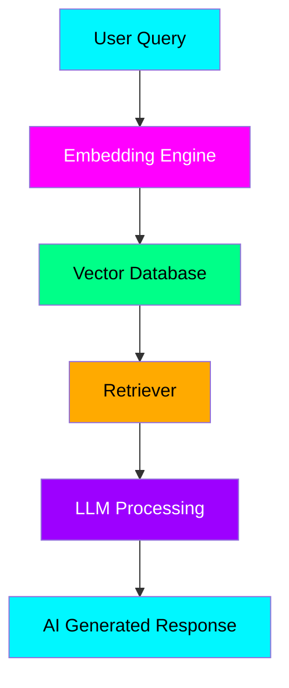

<div align="center">


# ⚡ NEURO RAG AI ⚡

### 🧠 Next Generation Intelligent Documentation Ecosystem

<p align="center">


</p>


<p align="center">


</p>

---

# 🌌 ABOUT THE PROJECT

> **Neuro RAG AI** is an ultra-futuristic AI-powered intelligent documentation and Retrieval-Augmented Generation platform engineered for next-generation semantic knowledge systems.

✨ Smart Knowledge Retrieval  
✨ Neural Intelligence  
✨ AI Context Awareness  
✨ Vector Database Integration  
✨ Real-Time Response Generation  
✨ Cyberpunk Futuristic Architecture  

---

# 🎥 LIVE AI MOTION

<p align="center">


</p>

---

# 🖼️ PROJECT PREVIEW

<p align="center">


</p>

---

# ⚡ CORE FEATURES

<table align="center">

<tr>

<td width="33%" align="center">

# 🧠 Neural AI

Advanced AI reasoning and semantic understanding engine.

</td>

<td width="33%" align="center">

# ⚡ Ultra Fast RAG

Blazing fast retrieval augmented generation system.

</td>

<td width="33%" align="center">

# 🌌 Futuristic Interface

Cyberpunk inspired modern AI ecosystem.

</td>

</tr>

<tr>

<td width="33%" align="center">

# 🔍 Semantic Search

Search by meaning, not just keywords.

</td>

<td width="33%" align="center">

# 📚 Structured Docs

Powerful intelligent documentation system.

</td>

<td width="33%" align="center">

# 🤖 AI Assistant

Real-time conversational intelligence layer.

</td>

</tr>

</table>

---

# 🚀 TECH STACK

<div align="center">

| Frontend | Backend | AI Engine | Database |
|----------|----------|------------|-----------|
| React.js | Node.js | OpenAI | MongoDB |
| Next.js | Express.js | LangChain | Pinecone |
| Tailwind CSS | FastAPI | HuggingFace | PostgreSQL |

</div>

---

# 🌌 FUTURISTIC AI GALLERY

<p align="center">


</p>

<p align="center">


</p>

---

# 🧬 SYSTEM ARCHITECTURE



---

# ⚙️ INSTALLATION

```bash
git clone https://github.com/anantmalik1/Neuro-Rag-AI.git

cd Neuro-Rag-AI

npm install

npm run dev
```

---

# 🌐 ENVIRONMENT VARIABLES

Create `.env` file:

```env
OPENAI_API_KEY=your_api_key

MONGODB_URI=your_database_url

PINECONE_API_KEY=your_pinecone_key
```

---

# 🛸 PROJECT STRUCTURE

```bash
Neuro-Rag-AI/
│
├── frontend/
├── backend/
├── ai-engine/
├── vector-db/
├── assets/
├── docs/
└── README.md
```

---

# 🔥 ADVANCED CAPABILITIES

✅ AI Powered Retrieval  
✅ Neural Embedding Search  
✅ Vector Intelligence  
✅ Dynamic Knowledge Retrieval  
✅ Real-Time AI Context  
✅ Multi-Model AI Integration  
✅ Semantic Memory System  
✅ Smart Documentation Layer  

---

# 📊 GITHUB ANALYTICS

<p align="center">


</p>

---

# 🧠 AI WORKFLOW ANIMATION

<p align="center">


</p>

---

# 🌟 ROADMAP

- [ ] Autonomous AI Agents
- [ ] Voice AI Integration
- [ ] Self-Learning Memory Layer
- [ ] Distributed Vector Network
- [ ] Multi-Language Intelligence
- [ ] AI Powered Dashboard
- [ ] 3D Interactive Interface

---

# 🤝 CONTRIBUTION

Contributions are welcome.

```bash
Fork → Clone → Create Branch → Commit → Push → Pull Request
```

---

# 🛡️ LICENSE

MIT License © 2026 Neuro RAG AI

---

# 💫 CREATOR

<div align="center">

# ⚡ ANANT MALIK ⚡

### Building The Future Of AI Documentation

<a href="https://github.com/anantmalik1">


</a>

<br><br>


</div>

---

<div align="center">

# ⭐ STAR THE REPOSITORY ⭐


</div>
